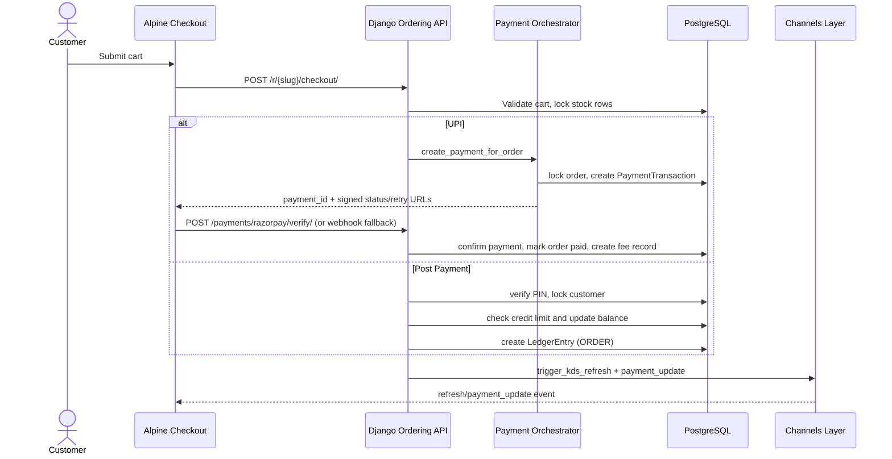
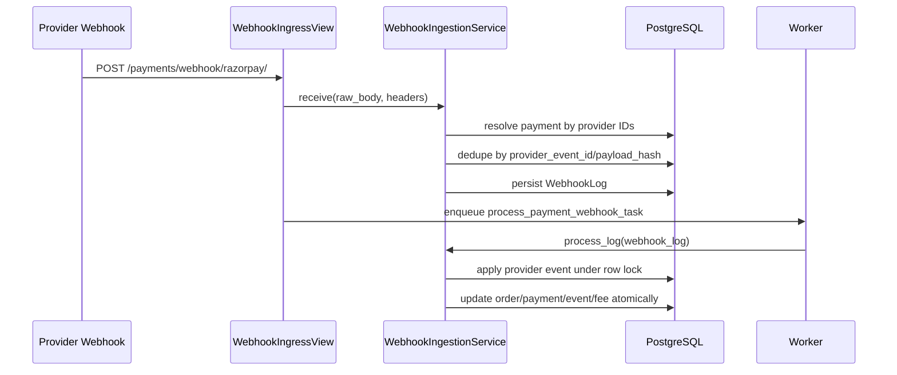
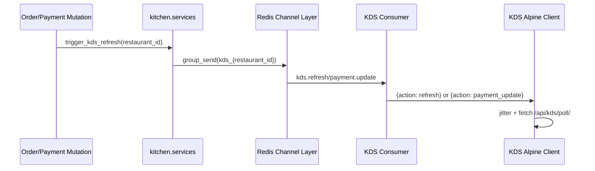

# Order-Flow Sequence Diagrams

## 1. Order -> Payment -> Balance -> Ledger

```mermaid
sequenceDiagram
    actor Customer
    participant UI as Alpine Checkout
    participant API as Django Ordering API
    participant PAY as Payment Orchestrator
    participant DB as PostgreSQL
    participant WS as Channels Layer

    Customer->>UI: Submit cart
    UI->>API: POST /r/{slug}/checkout/
    API->>DB: Validate cart, lock stock rows
    alt UPI
        API->>PAY: create_payment_for_order
        PAY->>DB: lock order, create PaymentTransaction
        PAY-->>UI: payment_id + signed status/retry URLs
        UI->>API: POST /payments/razorpay/verify/ (or webhook fallback)
        API->>DB: confirm payment, mark order paid, create fee record
    else Post Payment
        API->>DB: verify PIN, lock customer
        API->>DB: check credit limit and update balance
        API->>DB: create LedgerEntry (ORDER)
    end
    API->>WS: trigger_kds_refresh + payment_update
    WS-->>UI: refresh/payment_update event
```

## 2. Webhook Ingress and Idempotent Mutation

```mermaid
sequenceDiagram
    participant RZP as Provider Webhook
    participant IN as WebhookIngressView
    participant SVC as WebhookIngestionService
    participant DB as PostgreSQL
    participant JOB as Worker

    RZP->>IN: POST /payments/webhook/razorpay/
    IN->>SVC: receive(raw_body, headers)
    SVC->>DB: resolve payment by provider IDs
    SVC->>DB: dedupe by provider_event_id/payload_hash
    SVC->>DB: persist WebhookLog
    IN->>JOB: enqueue process_payment_webhook_task
    JOB->>SVC: process_log(webhook_log)
    SVC->>DB: apply provider event under row lock
    SVC->>DB: update order/payment/event/fee atomically
```

## 3. KDS Synchronization

```mermaid
sequenceDiagram
    participant MUT as Order/Payment Mutation
    participant KS as kitchen.services
    participant CH as Redis Channel Layer
    participant C as KDS Consumer
    participant UI as KDS Alpine Client

    MUT->>KS: trigger_kds_refresh(restaurant_id)
    KS->>CH: group_send(kds_{restaurant_id})
    CH->>C: kds.refresh/payment.update
    C->>UI: {action: refresh} or {action: payment_update}
    UI->>UI: jitter + fetch /api/kds/poll/
```
